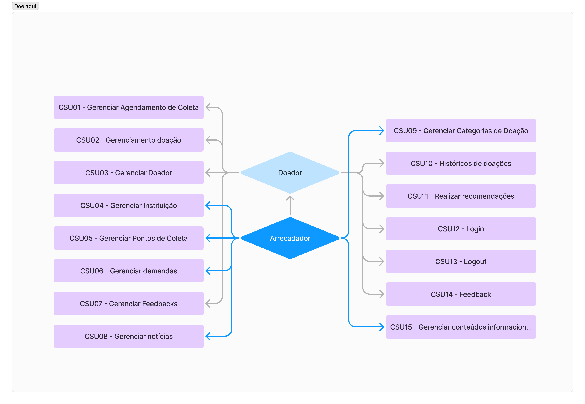
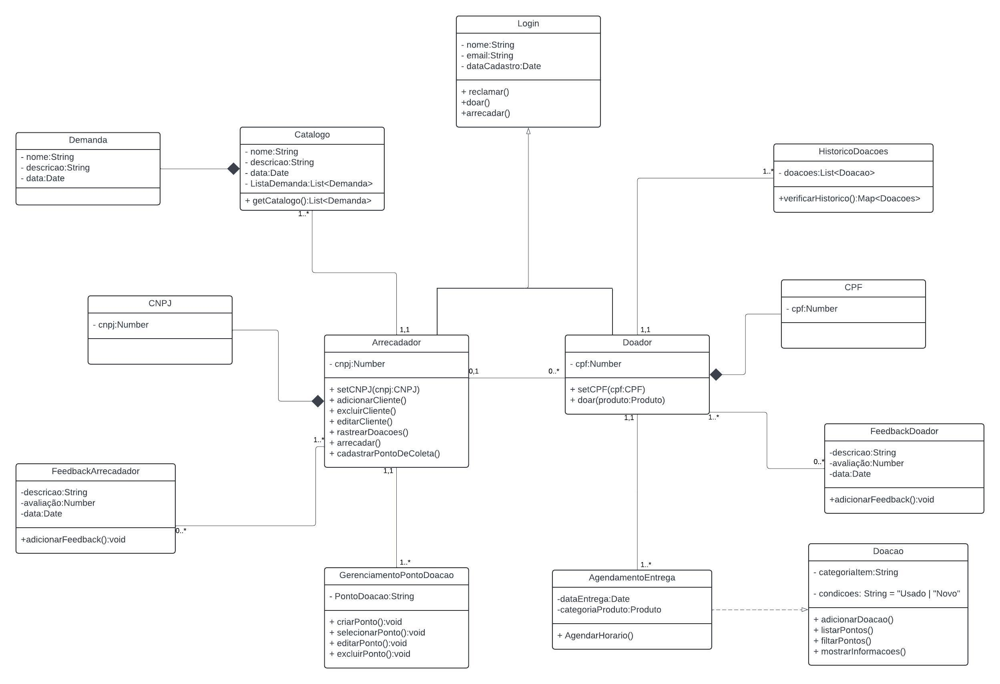

# 3. DOCUMENTO DE ESPECIFICAÇÃO DE REQUISITOS DE SOFTWARE

## 3.1 Objetivos deste documento
Descrever e especificar as necessidades e funções do projeto Doe Aqui.

## 3.2 Escopo do produto

### 3.2.1 Nome do produto e seus componentes principais
O produto será denominado Doe Aqui. (Ele terá dois componentes (módulo) com os  elementos necessários à doar e arrecadar.)

### 3.2.2 Missão do produto
Facilitar a Doação e Encontrar Instituições: O principal objetivo do projeto é auxiliar as pessoas a aprenderem como doar de forma mais eficiente e a encontrar instituições locais que estejam realizando campanhas de caridade. Isso permitirá que mais indivíduos contribuam para causas nobres de maneira fácil e direta.

### 3.2.3 Limites do produto
O Doe Aqui não fornece nenhuma forma de entrega ou recolhimento de doações.

### 3.2.4 Benefícios do produto

| # | Benefício | Valor para o Cliente |
|--------------------|------------------------------------|----------------------------------------|
|1	| Facilidade no cadastro de dados |	Essencial |
|2 | Facilidade na recuperação de informações | Essencial | 
|3 | Segurança com os dados coletados| Essencial | 
|4	| Praticidade no uso do software	| Recomendável | 
|5	| Software com o custo baixo | Recomendável | 

## 3.3 Descrição geral do produto

### 3.3.1 Requisitos Funcionais

| Código | Requisito Funcional (Funcionalidade) | Descrição |
|--------------------|------------------------------------|----------------------------------------|
| RF1 | Gerenciar Agendamento de Coleta (ou entrega da doação) |	O sistema deve permitir o cadastro, alteração e exclusão de agendamentos. |
| RF2	| Gerenciamento doação |	O sistema deve permitir o cadastro, a alteração, a exclusão e a consulta de doações. |
| RF3	| Gerenciar Doador |	O sistema deve permitir o cadastro, a alteração, a exclusão e a consulta de doadores. |
| RF4	| Gerenciar Instituição |	O sistema deve permitir o cadastro, a alteração, a exclusão e a consulta de instituições. |
| RF5	| Gerenciar Pontos de Coleta |	O sistema deve permitir o cadastro, a alteração, a exclusão e a consulta de pontos de coleta. |
| RF6	| Gerenciar demandas |	O Sistema deve permitir que o usuário pesquise um item, ex.: Roupas, cestas básicas, materiais de construção e etc. |
| RF7	| Gerenciar Feedbacks |	O Sistema deve permitir que o usuário cadastre, altere e exclua apenas o seu feedback. |
| RF8	| Gerenciar notícias |	O Sistema deve permitir que o usuário cadastre, altere e exclua notícias sobre sua doação ou do doador. |
| RF9	| Gerenciar Categorias de Doação |	O sistema deve permitir o cadastro, a alteração, a exclusão e a consulta de categorias de doações. |
| RF10 |	Históricos de doações	| O sistema deve permitir que o usuário veja e pesquise seu histórico de doações. |
| RF11 |	Realizar recomendações	| O sistema deve permitir que o usuário receba recomendações. |
| RF12	| Login |	O sistema deve realizar o login de pessoas e das instituições. |
| RF13	| logout |	O sistema deve realizar o logout de pessoas e das instituições. |
| RF14	| Feedbacks (avaliações de ambas as partes) |	O sistema deve permitir o feedback. |
| RF15 | Gerenciar conteúdos informacionais do site |	O sistema deve permitir o cadastro, a alteração, a exclusão, e a pesquisa de conteudos no site. |

### 3.3.2 Requisitos Não Funcionais

| Código | Requisito Não Funcional (Restrição) |
|--------------------|------------------------------------|
| RNF1 | O sistema deve garantir a segurança dos dados de acordo com a LGPD. |
| RNF2 | O sistema deve possibilitar qualquer realização de tarefas em no máximo 4 cliques. |
| RNF3 |	O sistema deve processar requisições dos usuários de no máximo 3 segundos. |
| RNF4 |	O sistema deve ser desenvolvido na tecnologia JavaScript/React. |

### 3.3.3 Usuários 

| Ator | Descrição |
|--------------------|------------------------------------|
| Arrecadador |	Usuário responsável por anunciar, organizar e receber doações. |
| Doador |	Usuário que vai procurar pontos de coleta para realizar sua doação. |

## 3.4 Modelagem do Sistema

### 3.4.1 Diagrama de Casos de Uso

Como observado no diagrama de casos de uso da Figura 1, o usuario poderá exercer dois papeis no sistema, o de doador e o de arrecadador, o primeiro com a possibilidade  de listar pontos de coleta, e o segundo com o poder de gerenciar os pontos de coleta, criando, atualizando e excluindo.

#### Figura 1: Diagrama de Casos de Uso do Sistema.

 
### 3.4.2 Descrições de Casos de Uso

#### 3.4.2.1 Gerenciar Agendamento de Coleta (CSU01)
**Sumário:** O sistema permite que o usuário cadastre, altere ou exclua agendamentos de coleta ou entrega de doações.

**Ator Primário:** Doador / Instituição.

**Pré-condições:** O usuário deve estar autenticado no sistema.

##### Fluxo Principal:

- O usuário acessa a funcionalidade de agendamentos.
- O sistema apresenta a lista de agendamentos existentes.
- O usuário seleciona a opção para cadastrar um novo agendamento, alterar ou excluir um agendamento existente.
- O sistema verifica a validade das informações fornecidas.
- Se as informações forem válidas, o sistema realiza a ação solicitada (cadastro, alteração ou exclusão) e exibe a confirmação.

##### Fluxo Alternativo (3): Inclusão

 - a) O usuário escolhe a opção para cadastrar um novo agendamento. 
 - b) O sistema apresenta um formulário solicitando os dados do agendamento. 
 - c) O usuário preenche o formulário com as informações necessárias. 
 - d) O sistema valida as informações e, se forem válidas, cadastra o novo agendamento.

##### Fluxo Alternativo (3): Alteração

 - a) O usuário escolhe um agendamento existente e solicita sua alteração. 
 - b) O sistema apresenta um formulário com os dados do agendamento. 
 - c) O usuário altera os dados e envia o formulário. 
 - d) O sistema valida as informações e, se forem válidas, atualiza o agendamento.

##### Fluxo Alternativo (3): Exclusão

 - a) O usuário seleciona um agendamento existente e solicita sua exclusão. 
 - b) O sistema confirma a solicitação e remove o agendamento.

**Pós-condições:** O agendamento foi cadastrado, alterado ou excluído com sucesso.

#### 3.4.2.2 Gerenciar Doação (CSU02)
**Sumário:** O sistema permite que o usuário cadastre, altere, exclua e consulte doações.

**Ator Primário:** Doador.

**Pré-condições:** O usuário deve estar autenticado no sistema.

##### Fluxo Principal:

- O usuário acessa a funcionalidade de gerenciamento de doações.
- O sistema apresenta uma lista de doações existentes.
- O usuário escolhe a opção de cadastrar, alterar, excluir ou consultar uma doação.
- O sistema realiza a operação solicitada (cadastro, alteração, exclusão ou consulta) e apresenta a confirmação.

##### Fluxo Alternativo (3): Inclusão

 - a) O usuário escolhe cadastrar uma nova doação. 
 - b) O sistema apresenta um formulário solicitando os detalhes da doação. 
 - c) O usuário preenche o formulário e o sistema valida os dados. 
 - d) O sistema cadastra a doação e apresenta a confirmação.

##### Fluxo Alternativo (3): Alteração

 - a) O usuário seleciona uma doação existente e solicita a alteração. 
 - b) O sistema apresenta um formulário com os dados atuais. 
 - c) O usuário altera os dados e o sistema valida as novas informações. 
 - d) O sistema atualiza a doação e apresenta a confirmação.

##### Fluxo Alternativo (3): Exclusão

 - a) O usuário seleciona uma doação existente e solicita sua exclusão. 
 - b) O sistema remove a doação e confirma a ação.

**Pós-condições:** A doação foi cadastrada, alterada, excluída ou consultada com sucesso.

#### 3.4.2.3 Gerenciar Doador (CSU03)
**Sumário:** O sistema permite que o usuario cadastre, altere, exclua e consulte seus dados como doador.

**Ator Primário:** Doador.

**Pré-condições:** O doador deve estar autenticado no sistema para ações diferentes da de cadastro.

##### Fluxo Principal:

- O doador acessa a funcionalidade de gerenciamento.
- O sistema apresenta os dados do doador autenticado.
- O administrador escolhe a opção de alterar, excluir ou consultar os dados.
- O sistema realiza a operação solicitada e apresenta a confirmação.

##### Fluxo Alternativo (3): Inclusão

 - a) O doador seleciona a opção de cadastrar um novo doador. 
 - b) O sistema solicita as informações necessárias. 
 - c) O doador preenche o formulário e o sistema valida os dados. 
 - d) O sistema cadastra o novo doador.

##### Fluxo Alternativo (3): Alteração

 - a) O doador seleciona um doador existente e solicita a alteração de seus dados. 
 - b) O sistema apresenta os dados do doador e permite a edição. 
 - c) O doador altera os dados e o sistema valida as novas informações. 
 - d) O sistema atualiza o cadastro do doador.

##### Fluxo Alternativo (3): Exclusão

 - a) O doador solicita a exclusão da sua conta. 
 - b) O sistema remove o cadastro do doador e apresenta a confirmação.

**Pós-condições:** O doador foi cadastrado, alterado, excluído ou consultado com sucesso.

#### 3.4.2.4 Gerenciar Instituição (CSU04)
**Sumário:** O sistema permite que o administrador cadastre, altere, exclua e consulte instituições.

**Ator Primário:** Administrador.

**Pré-condições:** O administrador deve estar autenticado no sistema.

##### Fluxo Principal:

- O administrador acessa a funcionalidade de gerenciamento de instituições.
- O sistema apresenta uma lista de instituições existentes.
- O administrador escolhe a opção de cadastrar, alterar, excluir ou consultar uma instituição.
- O sistema realiza a operação solicitada e apresenta a confirmação.

##### Fluxo Alternativo (3): Inclusão

 - a) O administrador escolhe cadastrar uma nova instituição. 
 - b) O sistema solicita os dados da instituição. 
 - c) O administrador preenche o formulário e o sistema valida os dados. 
 - d) O sistema cadastra a instituição.

##### Fluxo Alternativo (3): Alteração

 - a) O administrador seleciona uma instituição existente e solicita a alteração. 
 - b) O sistema apresenta os dados da instituição para edição. 
 - c) O administrador altera os dados e o sistema valida as novas informações. 
 - d) O sistema atualiza o cadastro da instituição.

##### Fluxo Alternativo (3): Exclusão

 - a) O administrador seleciona uma instituição existente e solicita sua exclusão. 
 - b) O sistema remove a instituição e confirma a ação.

**Pós-condições:** A instituição foi cadastrada, alterada, excluída ou consultada com sucesso.

#### 3.4.2.5 Gerenciar Pontos de Coleta (CSU05)
**Sumário:** O sistema permite que o usuário cadastre, altere, exclua e consulte pontos de coleta.

**Ator Primário:** Arrecadador / Administrador.

**Pré-condições:** O usuário deve estar autenticado no sistema.

##### Fluxo Principal:

- O usuário acessa a funcionalidade de gerenciamento de pontos de coleta.
- O sistema apresenta uma lista de pontos de coleta existentes.
- O usuário escolhe a opção de cadastrar, alterar, excluir ou consultar um ponto de coleta.
- O sistema realiza a operação solicitada (cadastro, alteração, exclusão ou consulta) e apresenta a confirmação.

##### Fluxo Alternativo (3): Inclusão

- a) O usuário seleciona a opção de cadastrar um novo ponto de coleta.
- b) O sistema solicita as informações do ponto de coleta.
- c) O usuário preenche o formulário com os dados necessários e o sistema valida as informações.
- d) O sistema cadastra o novo ponto de coleta e apresenta a confirmação.

##### Fluxo Alternativo (3): Alteração

- a) O usuário seleciona um ponto de coleta existente e solicita a alteração de seus dados.
- b) O sistema apresenta os dados atuais do ponto de coleta para edição.
- c) O usuário altera as informações e o sistema valida os novos dados.
- d) O sistema atualiza os dados do ponto de coleta e confirma a alteração.

##### Fluxo Alternativo (3): Exclusão

- a) O usuário seleciona um ponto de coleta existente e solicita sua exclusão.
- b) O sistema remove o ponto de coleta e confirma a exclusão.

**Pós-condições:** O ponto de coleta foi cadastrado, alterado, excluído ou consultado com sucesso.

#### 3.4.2.6 Gerenciar Demandas (CSU06)
**Sumário:** O sistema permite que o usuário pesquise demandas, como roupas, cestas básicas, materiais de construção, entre outros itens.

**Ator Primário:** Doador / Arrecadador.

**Pré-condições:** O usuário deve estar autenticado no sistema.

##### Fluxo Principal:

- O usuário acessa a funcionalidade de gerenciamento de demandas.
- O sistema apresenta um campo de busca para o usuário pesquisar itens específicos (ex.: roupas, cestas básicas).
- O usuário insere os critérios de busca.
- O sistema exibe uma lista de demandas correspondentes.
- O usuário pode selecionar uma demanda para visualizar mais detalhes.

##### Fluxo Alternativo (3): Não Encontrar

- a) Se a demanda pesquisada não for encontrada, o sistema informa o usuário e sugere novos critérios de busca.

**Pós-condições:** As demandas foram consultadas com sucesso.

#### 3.4.2.7 Gerenciar Feedbacks (CSU07)
**Sumário:** O sistema permite que o usuário cadastre, altere e exclua feedbacks de sua doação ou interação.

**Ator Primário:** Doador / Instituição.

**Pré-condições:** O usuário deve estar autenticado no sistema.

##### Fluxo Principal:

- O usuário acessa a funcionalidade de gerenciamento de feedbacks.
- O sistema apresenta os feedbacks já cadastrados pelo usuário.
- O usuário pode escolher cadastrar um novo feedback, alterar ou excluir um feedback existente.
- O sistema valida as informações e realiza a operação solicitada, confirmando a ação.

##### Fluxo Alternativo (3): Inclusão

- a) O usuário seleciona a opção de cadastrar um novo feedback.
- b) O sistema apresenta um formulário solicitando a avaliação e comentário.
- c) O usuário preenche o formulário e o sistema valida as informações.
- d) O sistema cadastra o feedback e apresenta a confirmação.

##### Fluxo Alternativo (3): Alteração

- a) O usuário seleciona um feedback existente e solicita a alteração.
- b) O sistema apresenta o feedback atual e permite a edição.
- c) O usuário altera os dados e o sistema valida as novas informações.
- d) O sistema atualiza o feedback e confirma a alteração.

##### Fluxo Alternativo (3): Exclusão

- a) O usuário seleciona um feedback existente e solicita sua exclusão.
- b) O sistema remove o feedback e confirma a exclusão.

**Pós-condições:** O feedback foi cadastrado, alterado ou excluído com sucesso.

#### 3.4.2.8 Gerenciar Notícias (CSU08)
**Sumário:** O sistema permite que o usuário cadastre, altere e exclua notícias relacionadas às suas doações ou às doações de outros usuários.

**Ator Primário:** Doador / Instituição.

**Pré-condições:** O usuário deve estar autenticado no sistema.

##### Fluxo Principal:

- O usuário acessa a funcionalidade de gerenciamento de notícias.
- O sistema apresenta uma lista de notícias existentes relacionadas às doações.
- O usuário pode escolher cadastrar uma nova notícia, alterar ou excluir uma notícia existente.
- O sistema valida as informações e realiza a operação solicitada, confirmando a ação.

##### Fluxo Alternativo (3): Inclusão

- a) O usuário seleciona a opção de cadastrar uma nova notícia.
- b) O sistema apresenta um formulário solicitando os detalhes da notícia.
- c) O usuário preenche o formulário e o sistema valida as informações.
- d) O sistema cadastra a notícia e confirma a inclusão.

##### Fluxo Alternativo (3): Alteração

- a) O usuário seleciona uma notícia existente e solicita sua alteração.
- b) O sistema apresenta os dados da notícia para edição.
- c) O usuário altera os dados e o sistema valida as novas informações.
- d) O sistema atualiza a notícia e confirma a alteração.

##### Fluxo Alternativo (3): Exclusão

- a) O usuário seleciona uma notícia existente e solicita sua exclusão.
- b) O sistema remove a notícia e confirma a exclusão.

**Pós-condições:** A notícia foi cadastrada, alterada ou excluída com sucesso.

#### 3.4.2.9 Gerenciar Categorias de Doação (CSU09)
**Sumário:** O sistema permite que o usuário cadastre, altere, exclua e consulte categorias de doações.

**Ator Primário:** Administrador.

**Pré-condições:** O administrador deve estar autenticado no sistema.

##### Fluxo Principal:

- O administrador acessa a funcionalidade de gerenciamento de categorias de doação.
- O sistema apresenta uma lista de categorias de doação existentes.
- O administrador pode escolher cadastrar uma nova categoria, alterar ou excluir uma categoria existente.
- O sistema valida as informações e realiza a operação solicitada, confirmando a ação.

##### Fluxo Alternativo (3): Inclusão

- a) O administrador seleciona a opção de cadastrar uma nova categoria.
- b) O sistema apresenta um formulário solicitando os dados da categoria.
- c) O administrador preenche o formulário e o sistema valida as informações.
- d) O sistema cadastra a nova categoria de doação e confirma a inclusão.

##### Fluxo Alternativo (3): Alteração

- a) O administrador seleciona uma categoria existente e solicita sua alteração.
- b) O sistema apresenta os dados atuais da categoria para edição.
- c) O administrador altera os dados e o sistema valida as novas informações.
- d) O sistema atualiza a categoria e confirma a alteração.

##### Fluxo Alternativo (3): Exclusão

- a) O administrador seleciona uma categoria existente e solicita sua exclusão.
- b) O sistema remove a categoria e confirma a exclusão.

**Pós-condições:** A categoria de doação foi cadastrada, alterada, excluída ou consultada com sucesso.

#### 3.4.2.10 Histórico de Doações (CSU10)
**Sumário:** O sistema permite que o usuário veja e pesquise seu histórico de doações.

**Ator Primário:** Doador.

**Pré-condições:** O usuário deve estar autenticado no sistema.

##### Fluxo Principal:

- O usuário acessa a funcionalidade de histórico de doações.
- O sistema apresenta uma lista com o histórico de doações realizadas pelo usuário.
- O usuário pode realizar uma pesquisa por critérios, como data ou tipo de doação.
- O sistema exibe os resultados da pesquisa conforme os critérios fornecidos.

##### Fluxo Alternativo (3): Sem Doações no Histórico

- a) Caso o usuário não tenha realizado doações, o sistema informa que não há registros no histórico.

**Pós-condições:** O usuário visualizou ou pesquisou com sucesso seu histórico de doações.

#### 3.4.2.11 Realizar Recomendações (CSU11)
**Sumário:** O sistema oferece recomendações para o usuário com base em suas atividades e interações no sistema.

**Ator Primário:** Doador / Arrecadador / Instituição.

**Pré-condições:** O usuário deve estar autenticado no sistema.

##### Fluxo Principal:

- O usuário acessa a funcionalidade de recomendações.
- O sistema analisa as doações e interações do usuário para gerar recomendações.
- O sistema exibe as recomendações ao usuário (ex.: novos pontos de coleta, doações sugeridas, instituições parceiras).
- O usuário pode optar por seguir as recomendações apresentadas.

##### Fluxo Alternativo (3): Sem Recomendações Disponíveis

- a) Se o sistema não tiver recomendações relevantes para o usuário, ele informa que não há sugestões disponíveis no momento.

**Pós-condições:** O usuário recebeu e visualizou recomendações.

#### 3.4.2.12 Login (CSU12)
**Sumário:** O sistema autentica o usuário para acesso às funcionalidades.

**Ator Primário:** Doador / Arrecadador / Instituição.

**Pré-condições:** O usuário deve ter um cadastro válido no sistema.

##### Fluxo Principal:

- O usuário acessa a página de login.
- O sistema solicita as credenciais (e-mail e senha) do usuário.
- O usuário insere suas credenciais e solicita o login.
- O sistema valida as credenciais e autentica o usuário.
- O sistema redireciona o usuário para a tela principal do sistema.

##### Fluxo Alternativo (3): Credenciais Inválidas

- a) Se as credenciais forem inválidas, o sistema informa o erro e solicita a correção.
- b) O usuário insere novas credenciais ou solicita a recuperação de senha.

**Pós-condições:** O usuário foi autenticado no sistema.

#### 3.4.2.13 Logout (CSU13)
**Sumário:** O sistema permite que o usuário saia de sua sessão.

**Ator Primário:** Doador / Arrecadador / Instituição.

**Pré-condições:** O usuário deve estar autenticado no sistema.

##### Fluxo Principal:

- O usuário acessa a opção de logout.
- O sistema solicita confirmação para encerrar a sessão.
- O usuário confirma e o sistema realiza o logout, redirecionando o usuário para a página inicial.
**Pós-condições:** O usuário foi desconectado do sistema.

#### 3.4.2.14 Feedbacks (Avaliações de Ambas as Partes) (CSU14)
**Sumário:** O sistema permite que doadores, instituições e arrecadadores enviem feedbacks sobre suas interações.

**Ator Primário:** Doador / Arrecadador / Instituição.

**Pré-condições:** O usuário deve estar autenticado no sistema.

##### Fluxo Principal:

- O usuário acessa a funcionalidade de feedbacks.
- O sistema apresenta uma lista de interações passíveis de avaliação.
- O usuário seleciona uma interação e preenche o formulário de avaliação.
- O sistema valida as informações e cadastra o feedback.
- O sistema exibe a confirmação da avaliação realizada.

##### Fluxo Alternativo (3): Alteração de Feedback

- a) O usuário pode acessar um feedback já realizado e solicitar a alteração dos dados.
- b) O sistema valida as informações alteradas e atualiza o feedback.

**Pós-condições:** O feedback foi cadastrado, alterado ou excluído com sucesso.

#### 3.4.2.15 62Gerenciar Conteúdos Informacionais do Site (CSU15)
**Sumário:** O sistema permite que o administrador cadastre, altere, exclua e pesquise conteúdos informacionais no site.

**Ator Primário:** Administrador.

**Pré-condições:** O administrador deve estar autenticado no sistema.

##### Fluxo Principal:

- O administrador acessa a funcionalidade de gerenciamento de conteúdos informacionais.
- O sistema apresenta uma lista de conteúdos já cadastrados.
- O administrador pode escolher cadastrar, alterar, excluir ou pesquisar conteúdos informacionais.
- O sistema realiza a operação solicitada (cadastro, alteração, exclusão ou pesquisa) e confirma a ação.

##### Fluxo Alternativo (3): Inclusão

- a) O administrador escolhe a opção de cadastrar um novo conteúdo.
- b) O sistema apresenta um formulário solicitando os detalhes do conteúdo informacional.
- c) O administrador preenche o formulário e o sistema valida as informações.
- d) O sistema cadastra o conteúdo informacional e apresenta a confirmação.

##### Fluxo Alternativo (3): Alteração

- a) O administrador seleciona um conteúdo existente e solicita sua alteração.
- b) O sistema apresenta os dados do conteúdo para edição.
- c) O administrador altera os dados e o sistema valida as novas informações.
- d) O sistema atualiza o conteúdo e confirma a alteração.

##### Fluxo Alternativo (3): Exclusão

- a) O administrador seleciona um conteúdo existente e solicita sua exclusão.
- b) O sistema remove o conteúdo e confirma a exclusão.

##### Fluxo Alternativo (3): Pesquisa

- a) O administrador insere critérios de busca para localizar um conteúdo específico.
- b) O sistema exibe os resultados da pesquisa de acordo com os critérios fornecidos.

**Pós-condições:** O conteúdo foi cadastrado, alterado, excluído ou pesquisado com sucesso.

### 3.4.3 Diagrama de Classes 

A Figura 2 mostra o diagrama de classes do sistema. A Matrícula deve conter a identificação do funcionário responsável pelo registro, bem com os dados do aluno e turmas. Para uma disciplina podemos ter diversas turmas, mas apenas um professor responsável por ela.

#### Figura 2: Diagrama de Classes do Sistema.
 

### 3.4.4 Descrições das Classes 

| # | Nome | Descrição |
|--------------------|------------------------------------|----------------------------------------|
| 01	|	Login |	Representa as informações de login de um usuário. Inclui nome, e-mail e a data de cadastro. Permite as ações de "reclamar", "doar" e "arrecadar". |
| 02	| Demanda |	Descreve uma demanda com nome, descrição e data. Está associada ao catálogo de demandas. |
| 03 |	Catalogo |	Contém uma lista de demandas. Possui atributos como nome, descrição, data, e métodos para retornar o catálogo. |
| 04 |	Doação |	Cadastro de informações e metodos relativos as Doações. |
| 05	|	CNPJ | Armazena o número de CNPJ de um cliente arrecadador. |
| 06	|	CPF |	Armazena o número de CPF de um doador. |
| 07	|	Arrecadador |	Representa um arrecadador (cliente com CNPJ). Possui métodos para adicionar, excluir, editar clientes e gerenciar doações. |
| 08	|	Doador |	Representa um doador (cliente com CPF). Possui métodos para realizar doações e associar CPF. |
| 09	|	GerenciamentoPontoDoacao |	Gerencia os pontos de doação. Inclui métodos para criar, selecionar, editar e excluir pontos de doação. |
| 10	|	AgendamentoEntrega |	Trata do agendamento de entregas, incluindo a data da entrega e a categoria de produtos. |
| 11	|	Doacao| Armazena informações sobre doações, incluindo a categoria de produtos e a condição do item (novo ou usado). Permite adicionar, listar e filtrar pontos de doação. |
| 12	|HistoricoDoacoes |	Armazena o histórico de doações. Possui um método para verificar o histórico de doações. |
| 13	|	FeedbackArrecadador |Armazena o feedback sobre o arrecadador, incluindo a descrição, avaliação e data do feedback. |
| 14	|	FeedbackDoador |		Armazena o feedback sobre o doador, incluindo a descrição, avaliação e data do feedback. |
